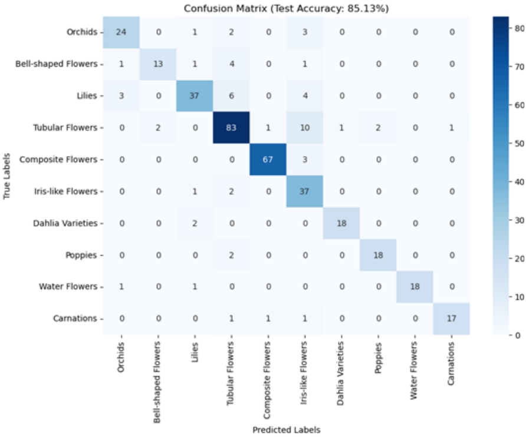
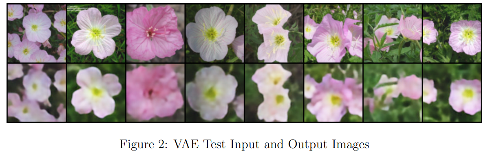
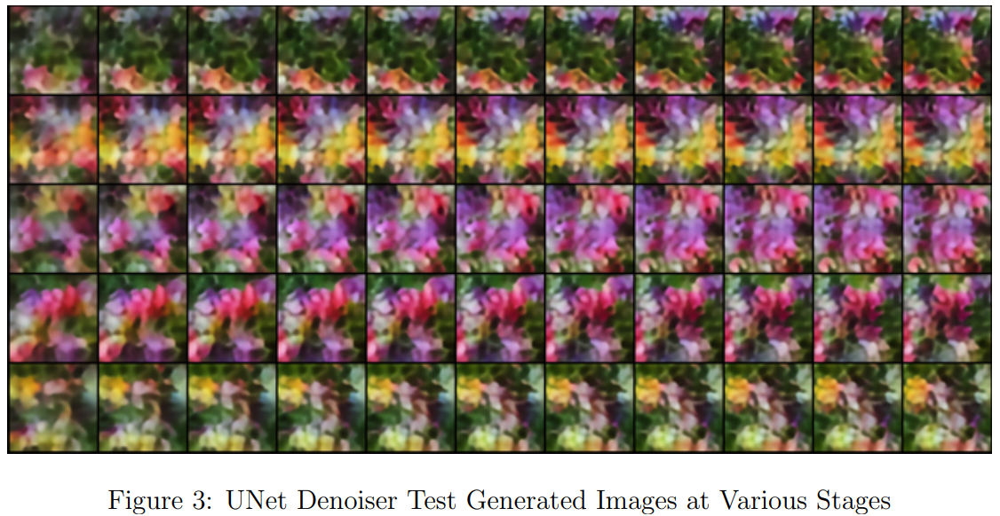

# Oxford Flowers Image Classification & Denoising Generation with PyTorch (CNN, VAE, UNet)

PyTorch implementations of three deep learning models trained on the **Oxford Flowers** dataset, covering image classification, image reconstruction, and latent-space denoising.

This project demonstrates several fundamental computer vision tasks:

* 🌸 **CNN** for flower classification
* 🖼️ **Variational Autoencoder (VAE)** for image reconstruction
* ✨ **UNet** for denoising latent image representations

---

# Project Overview

The repository contains four trained models:

| Model                         | Task                            |
| ----------------------------- | ------------------------------- |
| CNN (Coarse)                  | 10-class flower classification  |
| CNN (Fine)                    | 102-class flower classification |
| Variational Autoencoder (VAE) | Image reconstruction            |
| UNet                          | Latent representation denoising |

---

# Model Performance

| Model        |   Training |                                                 Result | Parameters |
| ------------ | ---------: | -----------------------------------------------------: | ---------: |
| CNN (Coarse) | 100 epochs |                               **85.13%** Test Accuracy |      ~452K |
| CNN (Fine)   | 100 epochs |                               **83.63%** Test Accuracy |      ~499K |
| VAE          |  60 epochs | **0.006244 ± 0.002823** Per-pixel Reconstruction Error |      ~6.3M |
| UNet         | 110 epochs |  **Train Loss:** 0.9388<br>**Validation Loss:** 0.9418 |     ~27.8M |

---

# Results

## CNN Classification (10 Classes)

The coarse CNN classifier achieved **85.13%** test accuracy on the 10-class flower dataset.

<p align="center">

</p>

*Confusion matrix of the 10-class CNN classifier.*

---

## Variational Autoencoder (VAE)

The VAE learns a compact latent representation and reconstructs flower images from it.

<p align="center">

</p>

*Comparison between input images and reconstructed outputs.*

---

## UNet Latent Denoiser

The UNet is trained to remove noise from latent representations produced during image generation.

<p align="center">

</p>

*Generated outputs at different denoising stages during inference.*

---

# Repository Structure

```text
.
├── cnn/
├── vae/
├── unet/
├── image/
│   ├── image_cnn.png
│   ├── vae.png
│   └── unet.png
├── Technical_Report.pdf
└── README.md
```

---

# Installation

### Requirements

* Python 3.10+
* PyTorch
* torchvision
* NumPy
* tqdm
* scikit-learn
* seaborn

Install all dependencies:

```bash
pip install torch torchvision numpy tqdm scikit-learn seaborn
```

---

# Notes

* The trained model **`UNet_110.pth`** is **not included** because it exceeds GitHub's 100 MB file size limit.
* The model can be reproduced by running the provided training scripts.
* A detailed technical report describing the model architectures, training procedures, experiments, and evaluation is included in this repository.

---

# Attribution

The dataset loading script **`load_oxford_flowers102.py`** was developed by **Dr. Lech Szymanski** for **COSC420 – University of Otago**.

The script provides PyTorch-compatible datasets with predefined training, validation, and testing splits for both:

* 10-class (coarse) labels
* 102-class (fine) labels

It is included and used in this project with permission.